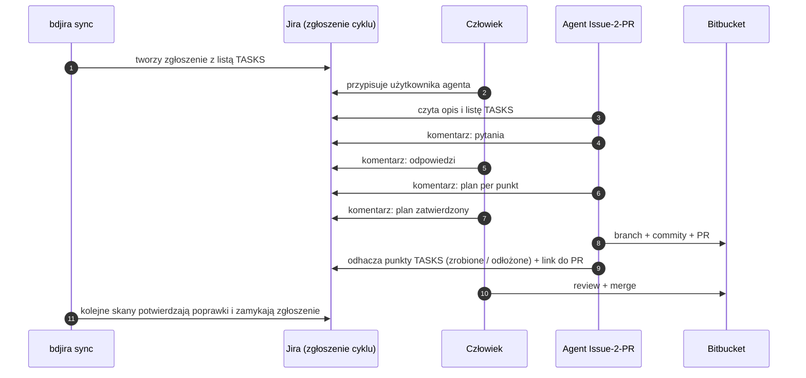

# Model zgłoszeń SCA w Jira pod Issue-2-PR — porównanie wariantów A / B / C

## Warianty

- **A** — zgłoszenie zbiorcze per aplikacja, per cykl.
- **B** — zgłoszenie główne per aplikacja + subtaski per komponent.
- **C** — epic per aplikacja + zwykłe zadania per komponent (Epic Link).

## Porównanie

N = liczba komponentów do poprawy w aplikacji.

| # | Kryterium | A — zbiorcze per cykl | B — główne + subtaski | C — epic + zadania | Czy przesądza? |
|---|---|---|---|---|---|
| 1 | **Issue-2-PR / praca człowieka** | 1 zlecenie, 1 dialog, 1 plan, 1 PR na aplikację | N zleceń, dialogów, planów i PR-ów | jak B | **TAK → A** |
| 2 | **Konflikty PR** | 1 PR, jedna zmiana `packages.lock.json` / `Directory.Packages.props`, build sprawdza cały graf zależności | N PR-ów zmienia te same pliki. Lock koliduje prawie zawsze, a zielony PR po merge sąsiada może zepsuć main. W praktyce PR-y trzeba zlecać po kolei | jak B | **TAK → A** |
| 3 | **Spam komentarzami** | Jedna etykieta `bd-content-*` obejmuje wszystkie znaleziska aplikacji. Zmiana dowolnego z nich to aktualizacja i komentarz na całym zgłoszeniu | Zmiana dotyka tylko zgłoszenia komponentu. Zgłoszenie główne nie może zbierać treści subtasków | Zmiana dotyka tylko zadania komponentu | nie |
| 4 | **Nowe znalezisko, gdy agent już pracuje** | Dopisanie zmieniłoby zakres pod zatwierdzonym planem. Lepiej skierować je do kolejnego zgłoszenia, więc przez chwilę aplikacja ma 2 otwarte | Nowy subtask, trwająca praca bez zmian | Nowe zadanie, trwająca praca bez zmian | nie |
| 5 | **Rozliczalność** | Słabsza: przy dużym zakresie agent może coś pominąć. Wymaga listy TASKS z checkboxami, którą agent odhacza punkt po punkcie | Bardzo dobra: małe zadanie, status = stan faktyczny | jak B | nie, ale **przewaga B/C** |
| 6 | **Domknięcie po merge** | Zgłoszenie zamyka się, gdy znikną wszystkie punkty. Punkty odłożone przechodzą do następnego cyklu | Każdy subtask zamyka się sam. Zgłoszenie główne wisi długo | Każde zadanie zamyka się samo. Epic nigdy się nie kończy | nie |
| 7 | **Board / sprinty** | 1 karta na cykl, łatwa do zaplanowania. Szczegóły są schowane w liście | Subtask musi być w sprincie rodzica. Velocity liczy rodzica, który się nie kończy. Najgorzej z trzech | Zwykłe karty. Przy dużym N zalewają board | nie; **C > A > B** |
| 8 | **Wzrost w czasie (2–4 lata)** | Rozmiar zgłoszenia jest ograniczony limitem 32 767 znaków (≈ 40 komponentów). Potrzebny limit punktów na cykl | Łańcuchy zgłoszeń per komponent-wersja. Zgłoszenie główne z setkami subtasków | Epic z setkami zadań | nie |

**Wspólne dla wszystkich:** dedup szuka tylko otwartych zgłoszeń. Zgłoszenie zamknięte jako
„Won't fix” / „Accepted risk” wraca więc jako duplikat w następnym skanie. Wymaga to poprawki
niezależnie od wariantu.

## Wniosek

- O wyborze przesądzają **kryteria 1 i 2**, oba na korzyść **A**. W wariantach B i C każdy komponent
  kosztuje człowieka osobny dialog i PR, a PR-y kolidują ze sobą na tych samych plikach.
- **B przegrywa z C w każdym kryterium** (board, sprinty, wzrost), a w Issue-2-PR działają tak samo.
  B odpada.
- **Ceną A jest rozliczalność** (5): jedno zgłoszenie nie pokazuje statusem, co zrobiono. Rekompensuje
  to lista TASKS z checkboxami: tworzy ją `bdjira sync`, a agent odhacza punkty.

**Rekomendacja:** wariant **A** pod trzema warunkami:
- lista TASKS z checkboxami,
- limit punktów na zgłoszenie,
- nowe znaleziska w trakcie pracy agenta trafiają do kolejnego zgłoszenia.

**Plan zapasowy:** wariant **C** z zadaniami zlecanymi po kolei. Przechodzimy na niego, jeśli agent
nie radzi sobie z wieloma punktami w jednym dialogu.

Przykład listy TASKS w opisie (wiki markup Jira DC nie ma natywnych checkboxów):

```
h2. TASKS
||ID||Stan||Komponent||Akcja||
|T-3f9a2c1d|[x] zrobione|Newtonsoft.Json 12.0.1|bump → 13.0.3|
|T-81c0d7e2|[ ] do zrobienia|System.Text.Encodings.Web 4.5.0|pin → 8.0.0|
|T-0a9e44b1|[!] odłożone|System.Drawing.Common 4.7.0|pin łamie Contoso.Core 3.x|
```

## Dialog agent ↔ człowiek (wariant A)


